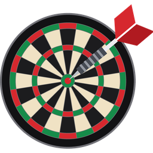

# 🎯 Premier League Darts voor Home Assistant

Zie in Home Assistant **wanneer, waar, hoe laat en wie** er speelt in de PDC Premier League Darts, met live stand per partij en de ranglijst.

## Wat je krijgt

| Entiteit | Wat het laat zien |
|---|---|
| `calendar.pl_darts_calendar` | Elke speelavond (stad + zaal) én elke partij als afspraak |
| `sensor.pl_darts_next_night` | Begintijd van de volgende avond, met stad, zaal en de indeling |
| `sensor.pl_darts_next_match` | Begintijd van de volgende partij, met beide spelers |
| `sensor.pl_darts_live_match` | Partij die nu bezig is, met tussenstand (anders `Geen`) |
| `sensor.pl_darts_last_result` | Laatst gespeelde partij met uitslag |
| `sensor.pl_darts_standings` | Koploper; de hele ranglijst staat in het attribuut `stand` |

Tussen seizoenen (zoals nu) staan de 17 speelavonden van het nieuwe seizoen al in de agenda, en toont de stand de eindstand van vorig jaar.

## Installeren via HACS

1. HACS → rechtsboven ⋮ → **Custom repositories**
2. URL van deze repository, categorie **Integration** → Add
3. Zoek **Premier League Darts** → Download → herstart Home Assistant
4. **Instellingen → Apparaten & diensten → Integratie toevoegen → Premier League Darts**

Er hoeft niets ingesteld te worden. Het eigen icoon verschijnt vanaf Home Assistant 2026.3.

## Dashboard

Plak [`examples/dashboard-kaart.yaml`](examples/dashboard-kaart.yaml) in een handmatige kaart. Alleen standaardkaarten, niets extra nodig. Een voorbeeld-melding vóór elke speelavond staat in [`examples/automatisering-melding.yaml`](examples/automatisering-melding.yaml).

## Hoe het werkt (en wat je moet weten)

- **Wedstrijden, tijden en uitslagen** komen van de onofficiële API van SofaScore. Die is niet bedoeld voor gebruik door derden en kan zonder waarschuwing veranderen of geblokkeerd worden. Gebruik het alleen voor eigen, niet-commercieel gebruik. Er wordt rustig gepeild: elk uur, op speeldagen elke 10 minuten en tijdens een avond elke minuut.
- **Steden en zalen** staan in `const.py` (`SCHEDULES`), overgenomen van het officiële PDC-schema. Voor een nieuw seizoen voeg je daar één blok toe.
- **De stand** wordt zelf berekend uit de uitslagen: winnaar 5 punten, verliezend finalist 3, verliezende halvefinalisten 2. Bij gelijke stand telt eerst het aantal gewonnen avonden, dan gewonnen partijen. Play-off-wedstrijden tellen niet mee.
- **Begintijd** van een avond zonder bekende indeling is een schatting (19:00 Britse tijd = 20:00 bij ons). Zodra de partijen bekend zijn, gebruikt de agenda de echte tijden.

## Ontwikkelen

```bash
pytest tests
```

De tests draaien zonder Home Assistant; ze controleren het inlezen van wedstrijden, de puntentelling en het koppelen aan het schema.

---

*Niet verbonden aan de PDC of SofaScore.*
